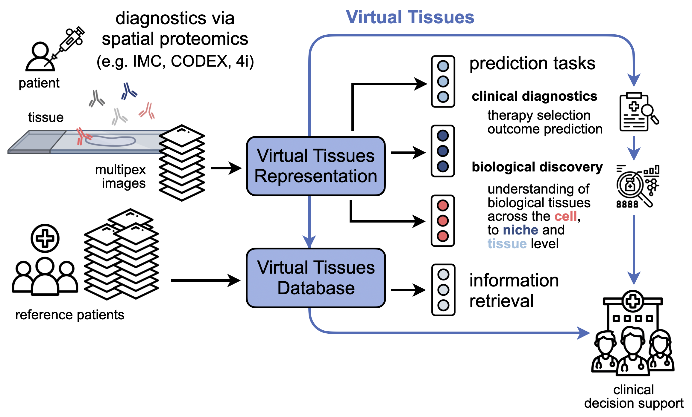

# VirTues
## AI-powered virtual tissues from spatial proteomics for clinical diagnostics and biomedical discovery

*[[Preprint]](https://arxiv.org/pdf/2501.06039), [[Supplement]](https://github.com/bunnelab/virtues/blob/main/.github/supplement.pdf), [[Model]](https://huggingface.co/bunnelab/virtues), 2025* 

**Authors:** Johann Wenckstern*, Eeshaan Jain*, Yexiang Cheng*, Benedikt von Querfurth, Kiril Vasilev, Matteo Pariset, Phil F. Cheng, Petros Liakopoulos, Olivier Michielin, Andreas Wicki, Gabriele Gut, Charlotte Bunne

Spatial proteomics technologies have transformed our understanding of complex tissue architecture in cancer but present unique challenges for computational analysis. Each study uses a different marker panel and protocol, and most methods are tailored to single cohorts, which limits knowledge transfer and robust biomarker discovery. Here we present Virtual Tissues (VirTues), a general-purpose foundation model for spatial proteomics that learns marker-aware, multi-scale representations of proteins, cells, niches and tissues directly from multiplex imaging data. From a single pretrained backbone, VirTues supports marker reconstruction, cell typing and niche annotation, spatial biomarker discovery, and patient stratification, including zero-shot annotation across heterogeneous panels and datasets. In triple-negative breast cancer, VirTues-derived biomarkers predict anti-PD-L1 chemo-immunotherapy response and stratify disease-free survival in an independent cohort, outperforming state-of-the-art biomarkers derived from the same datasets and current clinical stratification schemes. 

<br>
<p align='center'>

</p>

## Installation
To create a new conda environment `virtues` with Python 3.12 and install all requirements run:
```
source setup.sh
```

## Getting Started

### Configuration
Before running VirTues, please ensure that your base configuration found in `configs/base_config` is properly setup for your system. 
This includes setting the following fields:
```yaml
experiments_dir: <path-to-dir> # path of directory to save all training runs

experiment.name: <run-name> # the name of your training run
experiment.wandb_mode: 'disabled' | 'online' | 'offline' # set to 'disabled' to disable wandb logging
experiment.wandb_entity: <entity-name> # your wandb entity name, leave empty for default
experiment.wandb_project: <project-name> # your project name

datasets_config: <path-to-config> # path to config file describing training datasets

marker_embedding_dir: <path-to-dir> # path of directory containing marker embeddings saved as [UniprotID].pt files
```
Alternatively, you can set these fields from the command line when starting the training.

### Datasets
We provide a simple class `MultiplexDataset` to load datasets of multiplexed images. 
To setup a new dataset for this interface, we recommend following our file structure:
```z
path/to/datasets/folder/
├──[custom]/
│   ├──images/ # multiplexed images without processing, names must match 'tissue_id' column in tissue_index.csv
│   │  ├──[tissue_id].npy
│   │  ├──[tissue_id].npy
│   │  ├──...
│   ├──crops/ # precomputed image crops for training without preprocessing, names must match 'tissue_id' and 'crop_id' column in crop_index.csv
│   │  ├──[tissue_id]_[crop_id].npy
│   │  ├──[tissue_id]_[crop_id].npy
│   │  ├──...
│   ├──masks/ # cell segmentations masks, names must match 'tissue_id' column in tissue_index.csv
│   │  ├──[tissue_id].npy
│   │  ├──[tissue_id].npy
│   │  ├──...
│   ├──tissue_index.csv # tissue-wise annotations, must contain column 'tissue_id' and 'split'
│   ├──crop_index.csv # crop-wise annotations, must contain column 'tissue_id' and 'crop_id'
│   ├──channels.csv # list of markers and corresponding UniprotIDs measured by each channel, order must match images and crops 
│   ├──means.csv # channel-wise means for each tissue used for standardization during preprocessing, index must match 'tissue_id'
│   ├──stds.csv # channel-wise standard deviations for each tissue used for standardization during preprocessing, index must match 'tissue_id'
│   ├──quantiles.csv # channel-wise quantiles for each tissue used for clipping during preprocessing, index must match 'tissue_id'
│   ├──sce_annotations.csv # (not required for training) cell-wise annotations, must contain columns 'tissue_id' and 'cell_id' 
```

After setting up all datasets, you need to configure a .yaml file that specifies the paths to each dataset.
For orientation and demonstration purposes, we provide an example dataset containing a single tissue in `assets/example_dataset`, along with corresponding configuration files located at `configs/datasets/example_config.yaml` and `configs/datasets/example_config_multiple_datasets.yaml`.

Finally, for every measured marker across all datasets, a marker embedding must be precomputed using ESM-2 and stored in `marker_embedding_dir` following the naming convention `[UniprotID].pt`.
To faciliate this step, we provide two utility scritps.\
You can automatically download FASTA files containing the canonical amino acid sequence from Uniprot with the script `utils/download_fastas.py` by specifying a `.csv` file with column `protein_id` containing the Uniprot IDs (including potential isoform suffixes). For this run: 
```
python -m utils.download_fastas --output_dir [PATH] --csv [CSV-FILE]
```
To generate ESM-2 embeddings of these sequences, you can use the script `utils/compute_esm_embeddings.py` via:
```
python -m utils.compute_esm_embeddings --input_dir [PATH1] --output_dir [PATH2] --device [cpu/cuda] --model [MODEL]
```
Resulting embedings will be saved at `[PATH2]/[MODEL]/[UniportID].pt`. The official published weights of VirTues were trained with the ESM-2 model `esm2_t30_150M_UR50D` (set as default). For very long protein sequences, video memory requirements might be high. In this case, we recommend running the script using `--device cpu` and sufficient RAM.

### Training 
After setting up the datasets, VirTues can be pretrained via the `train.py` script. For example, to train an instance of VirTues with a custom dataset config run:
```bash
python -m train experiment.name=[NAME] datasets_config=[PATH]
```

The training script also supports distributed training. For this we recommend using torchrun. For example, to train on a single node with 4 GPUs run:
```bash
torchrun --standalone --nnodes=1 --nproc_per_node=4 -m train experiment.name=[NAME] datasets_config=[PATH]
```

All training results are stored in the `experiments_dir/experiment.name` directory.

### Inference

#### Pretrained Weigths
As an alternative to training a VirTues model from scratch, we also provide pretrained weights via [Hugging Face Hub](https://huggingface.co/bunnelab/virtues). For instructions, how to download and load these, please refer to the Demo notebooks below.

#### Demos

To help you start using a trained VirTues model for downstream analyses, the `notebooks` folder includes demonstrations of several common use cases:

-  `1_demo_reconstruction.ipynb` – Shows how to use VirTues to reconstruct partially masked channels or inpaint fully masked ones.
- `2_demo_cell_phenotyping.ipynb`  – Demonstrates how to compute cell tokens with VirTues, which can be used for applications such as cell phenotyping and virtual biomarker discovery.

## License and Terms of Use

Copyright (c) ECOLE POLYTECHNIQUE FEDERALE DE LAUSANNE, Switzerland,
Laboratory of Artificial Intelligence in Molecular Medicine, 2025

This model and associated code are released under the MIT Licence. See `LICENSE.md` for details. 

## Reference
If you find our work useful in your research or if you use parts of this code please consider citing our [paper](https://arxiv.org/abs/2501.06039):

```
@article{wenckstern2025ai,
  title={{AI-powered virtual tissues from spatial proteomics for clinical diagnostics and biomedical discovery}},
  author={Wenckstern, Johann and Jain, Eeshaan and Cheng, Yexiang and von Querfurth, Benedikt and Vasilev, Kiril and Pariset, Matteo and Cheng, Phil F. and Liakopoulos, Petros and Michielin, Olivier and Wicki, Andreas and Gut, Gabriele and Bunne, Charlotte},
  journal={arXiv preprint arXiv:2501.06039},
  year={2025},
  url={https://arxiv.org/abs/2501.06039}, 
}
```
